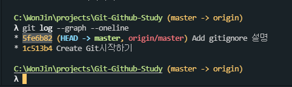
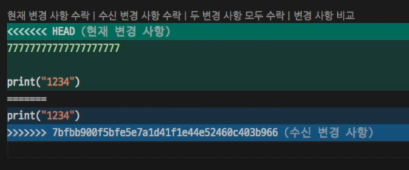

# Reset & Revert / conflict & merge

## reset & revert & Source History 명령어

### git reset: 커밋 취소하기

- git reset --[hard...] <revision번호>를 사용하면 현재 작업 위치인 HEAD의 포인터를 revision번호에 해당하는 위치로 변경해버릴 수 있습니다.
- reset한 위치로 변경하고, 위치 이후의 history는 모두 없애버립니다.
- (주의) hard는 시계(모든것)를 되돌립니다.

```
- git reset --[hard | soft | mixed] <revision번호>
```

### git revert: 커밋 내용 되돌리기

- git revert는 현재 작업 위치인 HEAD의 포인터를 revision번호에 해당하는 위치로 변경해줍니다.
- reset과 차이는 위치 변경 후에 history에 지우지 않고 소스 그대로 history에 새로운 Log가 생깁니다.

```
 git revert <revision번호>
```

### revision번호

- 아래사진에서 스크랩되어 있는 부분에 각 Log 마다 revision번호가 표시됩니다.



### Source History

- commit log를 그래프로 볼 수 있고, revision 번호도 확인할 수 있습니다.

```
git log --graph --oneline
```

---

## conflict & merge 명령어

### git merge

- 2 개의 브랜치를 하나로 합치는 것. 현재 위치한 브랜치를 기준으로 병합된다.
- 2 개의 브랜치를 합칠 때 만약 두 브랜치가 같은 파일의 같은 곳을 수정했다면 충돌(merge conflict)가 발생한다.
  - merge conflict 가 발생하면 관계자들이 상의하여 직접 코드를 수정하여 충돌을 해결해야한다.
  - 애초에 merge conflict 가 발생하지 않도록 즉 작업 내용이 겹치지 않도록 분담하는게 좋다.

```
git merge <브랜치이름> // ⏩ 현재 위치한 브랜치에 해당 브랜치를 가져와 merge 한다.
```

### conflict 발생

- (아래 사진 참고) 병합시 충돌이 일어났다면 병합을 진행하지 않고 현재 위치 중인 브랜치의 내용 (<<<<<< HEAD)과 병합하려는 대상인 브랜치의 (>>>>>> 브랜치이름) 내용 간의 다른 점을 보여준다.
  

- 위의 사진처럼 conflict를 해결하려면 editor에서 파일 수정합니다.

  - 수정 할 때 HEAD 부분을 수용하거나 수신된 변경을 수용, 또는 두 변경 사항을 모두 수용할 수 있습니다.

- 수정된 파일 저장 후 아래 명령 수행하면 comflict발생하지 않고 원격저장소에 push가 됩니다.

```
1. git add --all
2. git commit -am "aaaaa"
3. git push -u origin master
```
