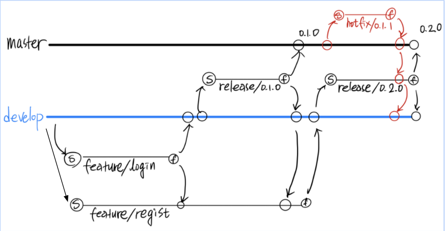

# Git Flow
## Git Flow 란?
Git-flow에는 5가지 종류의 브랜치가 존재합니다.
- master : 항상 서비스가능한 소스코드 가진 브랜치
- develop : 개발에 주축이되는 브랜치
- feature/ : 기능을 개발하는 브랜치
- release/ : 이번 출시 버전을 준비하는 브랜치
- hotfix/ : 출시 버전(master)에서 발생한 버그를 수정하는 브랜치

## Git Flow Commands
```
# 깃플로우 생성
$> git flow init

# 원격 저장소에 모든 브랜치를 전송하였다. 
$> git push origin --all

# feature branch를 생성
$> git flow feature start <feature-branch>

# 현재 feature branch 목록들을 살펴볼 수가 있다.
$> git flow feature list

$> git add .
$> git commit -m

# push & pull-request(to review) 후 해당 브랜치 작업이 완료되었을 때 finish로 완료한다.
$> git flow feature finish <feature-branch>

$ other-feature> git merge --no-ff develop

# 릴리즈 생성과 완료(merge)
$> git flow release start <tag>
$> git flow release finish <tag>

$> git tag

# 서버의 모든 브랜치와 태그까지 push
$> git push origin --all --follow-tags

# hotfix 생성과 완료(merge)
$> git flow hotfix start <tag>
$> git flow hotfix finish <tag>
```

## Ex. Try This
1. 2개 feature 시작 (login, regist)
2. login, regist 각각 코딩
3. login 작업 완료
4. login 코드 리뷰
5. login 릴리즈 & 배포 (0.1.0)
7. regist 작업완료
8. regist 릴리즈 (0.2.0)
9. 0.1.0에서 버그 발생!! → hotfix 시작
10. hotfix 0.1.1 작업완료
11. hotfix 0.1.1 코드리뷰
12. hotfix 0.1.1 배포(0.1.1)
13. regist 릴리즈 마무리 & 배포(0.2.0)

